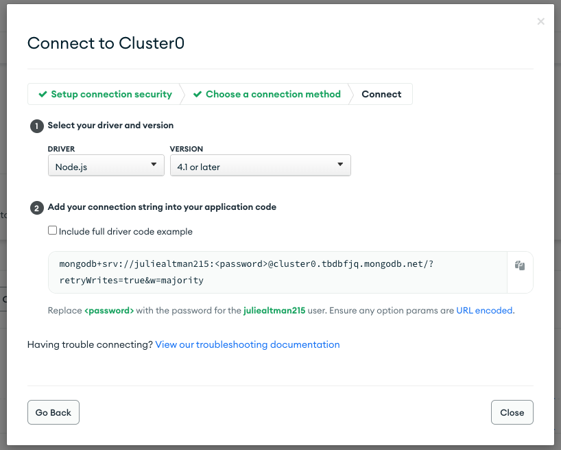
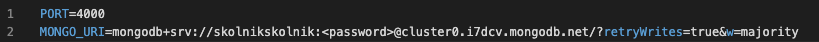

# Sagely Skills Assessment 

# Table of contents
1. [Description](#Description)
2. [Installation instructions](#Installation-instructions)
3. [Running a local instance](#Running-a-local-instance)
4. [Testing instructions](#Testing-instructions)
5. [License](#License)
6. [Questions](#Questions)
7. [Overview of Technologies](#Overview-of-technologies)

## Description: 
This is a skills assessment for Sagely. This is a web application in which the user is presented with a list of values, and the user can view more information on a separate page.

## Installation instructions: 
If you are not already a user for MongoDB: [create an account here](https://www.mongodb.com/atlas/database)

Establish a database connection:
1. Sign into MongoDB
2. If you already have a database, skip this step. If you do not already have a database, click "Build a Database", then verify that the information is accurate. You can use AWS and any region. You can optionally rename the cluster as well.
3. If you do not already have a username and password, create one using the "Database Access" tab on the left-hand navigation. You will need the username and password in a later step. 
4. On the left-hand navigation, select "Network Access", then click "Add IP Address", then "Add Current IP Address", then "Confirm".
5. On the left-hand navigation, select "Database", then click "Connect" next to the cluster name. Click "Connect your application", then copy the value down to a word document. You will need this for the next step. Your screen should look like this:  

First we need to make an env file
1. In the backend folder, create a file called '.env'
2. In this file, enter "PORT=4000" in the first line
3. In the second line, first enter 'MONGO_URI=', then take the string copied from step #6 in the previous set of directions, and copy and paste that. Make sure to put your mongodb password instead of the placeholder. The file should look like this, but substitute in your mongodb username and password: 

Then you will need to install the node packages. To do so, open a terminal in the root folder.
1. Navigate to the backend folder by typing 'cd backend' and type 'npm install'
2. Navigate to the frontend folder, and type 'npm install'

First time users will need to seed the database. To do so:
1. Navigate to the backend folder, then run the 'npm run seed' command

The application is installed and ready to run!

## Running a local instance:
1. Open a terminal and navigate to the backend folder. Run the command 'npm start'
2. Open a second terminal and navigate to the frontend folder. Run the command 'npm run start'

## Testing instructions: 
1. With the web app running in a browser, click "See more" on any item. 
2. Once on the other page, copy the mongoid from the URL in the browser, for example "638027e9d9a73469e090435b" from "http://localhost:3000/638027e9d9a73469e090435b"
3. Open item.test.js in the "tests" folder, which is found in the backend folder
4. On line 34, replace the existing mongoId with the one from the browser.
5. Open a terminal, navigate to the backend folder and enter 'npm run test'.

## License:  
This project is covered under the MIT License license.

## Questions
Visit my <a href='https://www.github.com/skolnikskolnik'>github page.</a> 

Email me at juliealtman215@gmail.com with any additional questions you may have. I am always happy to talk to users of my product!
    
## Overview of technologies used

The backend uses a MongoDB database run on an express server. The csv file is converted to json using the fastcsv package.

The frontend is React application using Bootstrap components and the sass node package. 

The testing is done using supertest